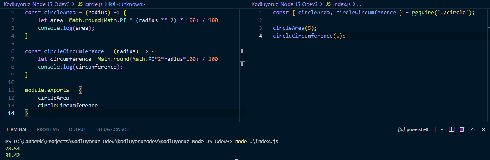

# Daire Modülü Uygulaması

---
- circleArea fonksiyonu radius parametresini alarak tanımlandı.
- circleCircumference fonksiyonu radius parametresini alarak tanımlandı.
- Pi değeri Math.PI fonksiyonu ile bulundu.
- module.exports yöntemiyle fonksiyonlar export edildi.
- require ve object destructing kullanılarak fonksiyonlar index.js içerisinde kullanıma hazırlandı.
- fonksiyonlar kullanılarak ekran çıktıları alındı.