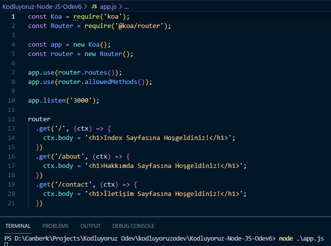

# Koa.js ile web sunucusu yazımı

- Koa.js ve Koa-router paketleri indirildi.
- /node-modules gitignore'a eklendi.
- Port numarası olarak 3000 belirlendi.
- Router yönlendirmeleri yapılarak index, hakkımda ve iletişim sayfaları oluşturuldu.
