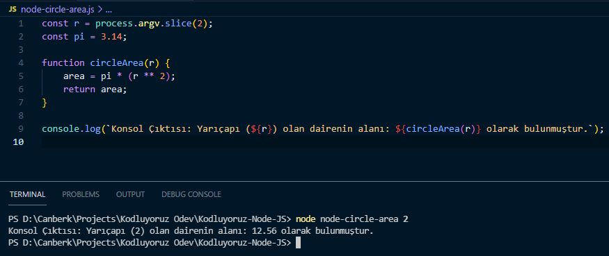

# Dairenin Alanının Bulunması

Yarıçapı 3 olan dairenin alanını bulmak için konsola `{node node-circle-area 3}` yazabilirsiniz.

Farklı yarıçaplardaki dairelerin alanını bulmak için 3 değerini istediğiniz değer ile değiştirebilirsiniz.

